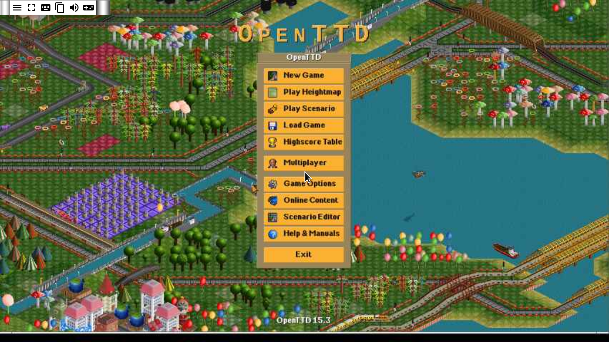
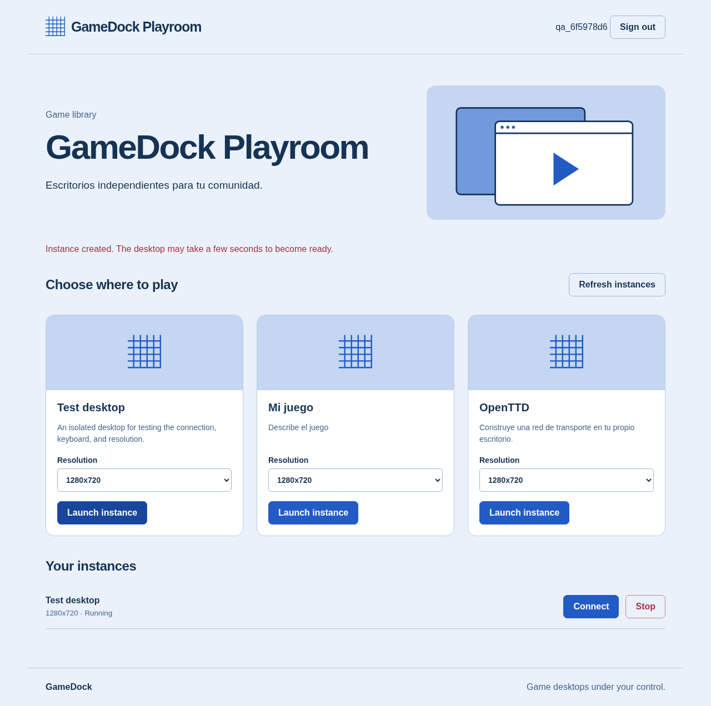
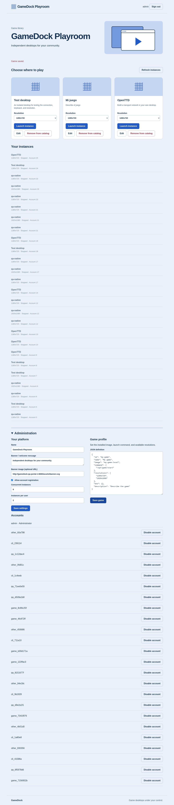

# GameDock

A framework for serving game desktops through a browser, extracted from the
Starloco harness. Accounts and configuration are independent of Dofus.

Includes registration, sign-in and sign-out, a bootstrap administrator, an editable
game catalog, platform name and banners, per-game resolutions, global and per-user
limits, account management, instance termination, and a CLI. Each instance runs a
command in its own container. The portal authenticates HTTP and WebSocket access
to Xpra; session containers do not publish ports to the host.

## Screenshots

OpenTTD running through the browser:



Game library:



Administration:



## Getting started

Requirements: a Linux server with Docker Engine 26+ and Docker Compose. Tested on
x86_64. Serving the platform does not require Dofus, Wine, or Python on the host.

```sh
git clone git@github.com:HectorPulido/gamedock.git
cd gamedock
cp .env.example .env
# Edit .env: ADMIN_PASSWORD must contain at least 12 characters.
docker build -t gamedock-runtime:local runtime
docker compose up -d --build
```

Open `http://localhost:8080` and sign in with `ADMIN_USER` and `ADMIN_PASSWORD`.
The administrator is created on the first startup; changing `.env` does not change
existing passwords. The initial library includes an xterm desktop for testing
display, keyboard, and mouse input. Use Administration to change the name, welcome
message, banner image, registration policy, limits, game profiles, and account status.

For remote access, set `PUBLIC_URL` to the exact public HTTPS origin and place an
HTTPS proxy in front of the portal. Preserve paths and query strings and allow
WebSocket upgrades (Upgrade/Connection). Cookies use Secure when `PUBLIC_URL` uses
HTTPS. By default, the portal binds only to loopback. Do not expose session ports
or the Docker socket. Administrators are trusted operators: they select images
and commands, and the portal has access to the Docker daemon.

## Launch an instance from the command line

The CLI requires Python 3 and has no additional dependencies.

```sh
python3 cli/gamedock.py --url http://localhost:8080 register player
python3 cli/gamedock.py login player
python3 cli/gamedock.py launch desktop --resolution 1920x1080
python3 cli/gamedock.py list
python3 cli/gamedock.py stop INSTANCE_ID
python3 cli/gamedock.py logout
```

`launch` prints the instance ID and desktop URL. Sign in to the browser with the
same account to connect. Passwords are prompted for rather than passed as command
arguments. CLI tokens expire after 24 hours and are stored with permissions 0600
in `~/.config/gamedock/session.json`. Use `GAMEDOCK_URL` or `--url` to select the
server and `--credentials` to maintain separate sessions.

## Add a game

Derive an image from `gamedock-runtime:local`, install the program, and keep the
`player` user (UID 1000). The working directory is `/data`, persisted per account
and game. Create a profile through Administration or the CLI as an administrator:

```json
{
  "id": "my-game",
  "name": "My game",
  "description": "A game for your community",
  "banner": "https://example.com/banner.jpg",
  "image": "my-game:local",
  "command": ["/opt/game/start", "--server", "example.com"],
  "resolutions": ["1280x720", "1920x1080"],
  "env": { "LANG": "en_US.UTF-8" }
}
```

```sh
python3 cli/gamedock.py profile my-game.json
python3 cli/gamedock.py launch my-game --resolution 1280x720
```

`command` is an argument list with no implicit shell interpretation. If a shell
is needed, administrators can explicitly specify `["sh", "-c", "your command"]`.
Build or pull the image on the server before launching; GameDock does not pull
images automatically. Per-game banners are optional HTTP(S) image URLs. The
platform supports a welcome message and a banner image. Launch commands, images,
and environment variables are visible only to administrators. Do not use profile
environment variables to store individual users' secrets.

The runtime uses Xvfb, Openbox, and Xpra without audio. It supports X11 applications
and games compatible with software rendering. GPU access, controllers, audio,
anti-cheat, and 3D acceleration require adapting the image and device policy;
compatibility with every game is not guaranteed. Default per-session limits are
4 GiB of RAM, 2 CPUs, and 256 processes, configured in `server/app.py`.

### Ready-to-play example: OpenTTD

```sh
docker build -t gamedock-openttd:local examples/openttd
./bin/gamedock profile examples/openttd/profile.json
./bin/gamedock launch openttd --resolution 1280x720
```

Includes the free game and OpenGFX graphics from Fedora repositories, without
requiring commercial client files. Configuration and saved games are stored in
`/data`. `./bin/gamedock` accepts all CLI commands listed above.

### Minecraft and Windows

`examples/minecraft/` provides an image and profile for a Linux Java launcher.
Supply your client or launcher with its libraries and resources at
`examples/minecraft/client/launcher.jar`. It must open a graphical interface and
support Java 21; adapt the command if it uses a different format. No client is
included, and authentication and licensing are not bypassed. This is not a
universal official launcher configuration.

```sh
docker build -t gamedock-minecraft:local examples/minecraft
python3 cli/gamedock.py profile examples/minecraft/profile.json
python3 cli/gamedock.py launch minecraft --resolution 1280x720
```

`examples/wine/` provides a Windows adapter. Put the game files in
`examples/wine/client/`, adjust `Game.exe`, build `gamedock-wine:local`, and import
its `profile.json`. The Wine prefix is persisted at `/data/wine`. The historical
Dofus image under `upstream/` is reference material, not an executable dependency.

## Persistence and operation

- The `gamedock_gamedock-data` volume stores SQLite data: accounts, scrypt password
  hashes, revocable tokens, profiles, configuration, and instance history.
- `NAMESPACE-user-UID-GAME` persists `/data`. The namespace defaults to the Compose
  project name (`gamedock`). Set `GAMEDOCK_NAMESPACE` explicitly using 1–40 lowercase
  letters, digits, underscores, or hyphens. Keep it stable and use distinct names
  for deployments that must not share files. Multiple sessions for the same
  account and game share files. For games that lock their profiles, set the
  per-user limit to 1 or use separate profiles. Save before stopping an instance:
  stopping removes the container but preserves its volume.
- State is reconciled with Docker when listing or creating instances. Recreating
  the portal preserves desktops and accounts. Signing out revokes desktop access
  without terminating the game. Disabling an account revokes its tokens and
  terminates its instances.
- `docker compose logs -f portal` shows operational errors without printing tokens
  or passwords. Stop instances through Administration before removing the
  platform: `docker compose down` stops the portal, not its session containers.
- Back up SQLite consistently along with game volumes. Do not commit `.env`,
  databases, tokens, or game clients. Source files and build instructions are
  fully defined by the repository.

## API

Mutations require `Content-Type: application/json`; send `{}` for requests with no
fields. Authenticate with an HttpOnly cookie or `Authorization: Bearer TOKEN`.
Do not put tokens in URLs. Other users' instances return 404; administrators can
manage all instances.

| Method     | Route                                   | Purpose                                 |
| ---------- | --------------------------------------- | --------------------------------------- |
| GET        | `/api/catalog`                          | Public settings, account, and games     |
| POST       | `/api/auth/register`, `/api/auth/login` | `{username, password}`                  |
| POST       | `/api/logout`                           | Revoke the current session              |
| GET / POST | `/api/instances`                        | List / create with `{game, resolution}` |
| DELETE     | `/api/instances/ID`                     | Stop an instance                        |
| GET / WS   | `/desktop/ID/…`                         | Authenticated desktop access            |
| PUT        | `/api/admin/settings`                   | Name, banners, registration, limits     |
| PUT        | `/api/admin/games`                      | Create or replace a profile             |
| DELETE     | `/api/admin/games/ID`                   | Remove a profile                        |
| GET        | `/api/admin/users`                      | List accounts                           |
| PATCH      | `/api/admin/users/ID`                   | `{enabled: true/false}`                 |

## Validation

Run the complete suite on Linux using only the dedicated Docker QA project:

```sh
./scripts/qa.sh
```

Requires Python 3 and Docker Compose with `--wait`. QA credentials remain outside
the repository, and screenshots are written to `/tmp/gamedock-artifacts`. The
suite verifies that recreating the portal does not restart games and that volumes
survive instance replacement. Run browser tests sequentially on a stable Docker
network; do not use host networking while creating session networks.

```sh
docker build -t gamedock-portal:local .
docker run --rm -v "$PWD:/app:ro" gamedock-portal:local python -m unittest discover -s tests -v
```

`tests/live.py` checks the API and CLI, native commands, two real desktops, Xvfb
resolutions, persistence, proxying, isolation, and port exposure. Run it on the
host with Python 3 and the Docker CLI against a disposable QA deployment at
localhost:18088. It reads bootstrap credentials from `/tmp/gamedock-qa.env`.
Do not run it against real accounts. `tests/browser.py` checks registration,
launching, rendered desktop pixels, real keyboard input, WebSocket revocation,
termination, and mobile layout. `tests/game_browser.py` checks administration
forms, the banner image, and a real OpenTTD session. Build the browser environment
with `tests/Dockerfile.browser`; screenshots are written to `/artifacts`. The QA
portal uses `PUBLIC_URL=http://gamedock-qa-portal-1:8080`, passed to the browser as
`QA_URL`; the QA CLI connects through loopback:18088.

## Provenance

`upstream/` contains reference code extracted from `HectorPulido/starloco-private`.
`upstream/REVISION` identifies the original source commit. Reference messages and
default language settings have since been translated to English; the files are
not byte-for-byte copies of that revision. The extraction did not modify or
restart Dofus. The framework runs without accessing Dofus services or databases.
